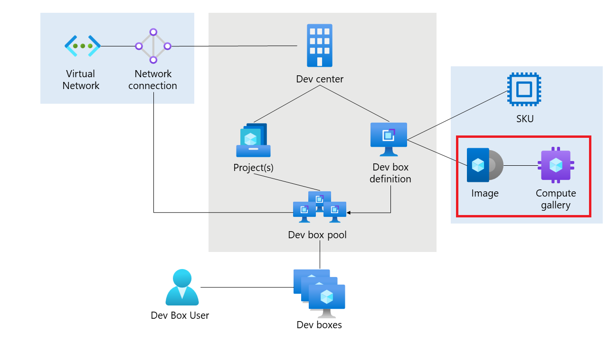

# Custom DevBox Image Demo

## Overview

This repository creates an Azure Image Builder template which will automatically trigger the creation of an Azure Image that can be used by DevBox.

## Requirements

- Install the AZ CLI tool
- Connect to your Azure tenant using `az login`
- Connect to the appropriate subscription `az account set --subscription $subscriptionID`
- Access in Azure to create resources (Requires Owner permission as the demo assigns an RBAC role to a managed identity)
- Ensure that the correct resource providers are enabled on the subscription [resource provider docs](https://learn.microsoft.com/en-us/azure/dev-box/how-to-customize-devbox-azure-image-builder#create-a-windows-image-and-distribute-it-to-azure-compute-gallery)

## What's Included

The code in this repository will create the following resources in Azure:

- **Azure Compute Gallery:** A gallery for Virtual Machine images to be stored and distributed for consumption.
- **VM Image Definition:** The Image definitions that are versioned and publish to the Compute Gallery.
- **Image Template:** Azure Image Builder template used to create a Virtual Machine image that can be used by DevBox.
- **Deployment Script:** Triggers the `image template build` to create a new image.
- **Managed Identity:** The identity used by the Virtual Machine Image definition to spin-up a Virtual Machine, Virtual Network and create an image.

## Custom Image Changes

The scripts that Azure Image Builder will use to build the image template for DevBox are in the `installScripts` directory. The reason the scripts are split out of the Bicep module is to:

- Simplifies developing custom images.
- Improves testing and readability by supporting writing scripts in PowerShell directly.
- Allow linting on scripts and encourage the use of advanced PowerShell.
- Reduces the error-rate of needing to write PowerShell within a Bicep module.
- Enables reusing and sharing scripts.

### Scripts

The structure used in this repository can be used as an example for installing any required security or operational toolings.

- **common.ps1:** Used for any mandatory or shared tooling that should be installed on any DevBox image. This saves needing to store and write the same install commands for different images.

- **developers.ps1:** An example of how to setup a install script for a specific persona. This script is passed through to the `deploy.bicep` script and used in the `developerImage` module.

To create a new profile, simply copy the existing `developerImage` module and update the appropriate fields.

## Installation Instructions

1. Create a resource group in Azure to store the custom image resources in.
1. Clone this repository and update the `deploy.bicep` file variables.
1. *(Optional)* - Update the PowerShell scripts in the `installScripts` directory.
1. Run the following command to deploy the resources: `az deployment group create --name devboxtest --resource-group $yourResourceGroup --template-file deploy.bicep`.   **Note:** The Image build process is slow and can take 30 minutes.
1. Assign the DevCenter instance access to the Resource Group used in the above steps.
1. Add the compute gallery to your DevBox instance.
1. Then add the new image to a dev box definition.   **Note:** The validation process can take 15 minutes.  

1. Test the new custom image.

### Troubleshooting

To troubleshoot the Custom Image creation and installation of the scripts, follow the [troubleshooting guide](https://learn.microsoft.com/en-us/azure/virtual-machines/linux/image-builder-troubleshoot).

 

The code in the developer.ps1 file writes the chocolatey log file to the console so it can be picked up in the above troubleshooting guide.

## Documentation

- [What is Microsoft Dev Box?](https://learn.microsoft.com/en-us/azure/dev-box/overview-what-is-microsoft-dev-box)
- [DevBox QuickStart](https://github.com/luxu-ms/Devbox-ADE-Infra/tree/main)
