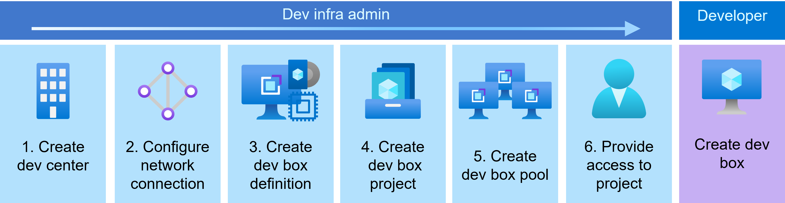

# Custom DevBox Image Demo

## Overview

This repository creates a Azure Image Builder template which can then be used to `build` a image. This image can then be added to dev definition in the DevBox portal and used to provision VMs.

## Requirements

- Install the AZ CLI tool
- Connect to your Azure tenant using `az login`
- Connect to the appropriate subscription `az account set --subscription $subscriptionID`
- An existing Resource Group
- Ensure that the correct resource providers are enabled on the subscription [resource provider docs](https://learn.microsoft.com/en-us/azure/dev-box/how-to-customize-devbox-azure-image-builder#create-a-windows-image-and-distribute-it-to-azure-compute-gallery)

## Instructions

1. Clone this repository and update the `deploy.bicep` file variables.
1. Run the following command to deploy the resources: `az deployment group create --name devboxtest --resource-group $yourResourceGroup --template-file deploy.bicep`.   **Note:** The Image build process is slow and can take 30minutes.
1. Add the compute gallery to your DevBox instance.
1. Then add the new image to a dev box definition.   **Note:** The validation process can take 15minutes.
1. Test the new custom image.

## Custom Image Changes

To make changes / add to the custom image, you can open the `deploy.bicep` file and add any install commands to the `Customize` parameter. There's already an existing example in the file.

You can also copy the existing developer template (which is an example) and create different image profiles.
